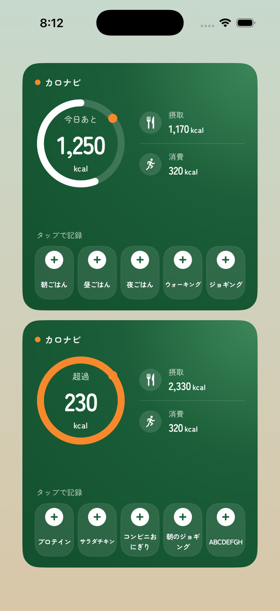
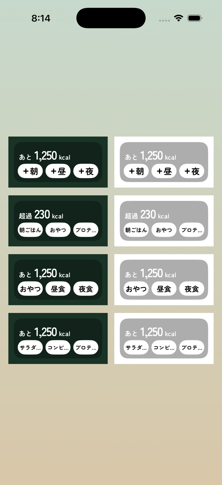

# カロナビ ウィジェット デザイン仕様

ホーム画面ウィジェット（大）とロック画面ウィジェット（横長）の見た目の正本です。
ウィジェットの見た目を変えるときは、このファイルと実装を同時に直してください。

| 置き場所 | 中身 |
| --- | --- |
| [`ios/LockScreenMealWidget/LockScreenMealWidget.swift`](../../../ios/LockScreenMealWidget/LockScreenMealWidget.swift) | 実装（SwiftUI / WidgetKit）。この仕様の値はここに書いてある |
| [`home.png`](home.png) / [`lock.png`](lock.png) | 実装のビューをシミュレータで描画した画像（モックではなく実物） |
| [`mockup.html`](mockup.html) | ブラウザで開けるモック。壁紙を切り替えてロック画面の見え方を比べられる |
| [`lib/services/lock_screen_meal.dart`](../../../lib/services/lock_screen_meal.dart) | ウィジェットに渡すデータ（数値・ボタンのラベル）を書く側 |

アプリ全体の仕様は [`../デザイン仕様.md`](../デザイン仕様.md)。色の値は `lib/theme/app_colors.dart` と同じです。

---

## 1. 共通の考え方

- 主役は「今日あと」何kcalか（デザイン仕様の Energy First）。超過した日は、アプリのホームと同じく「超過 ○kcal」と出し、リングをオレンジにする（Trust）。
- ボタンは押すとアプリを開かずに1件記録する（`RegisterMealWidgetIntent`、`openAppWhenRun = false`）。ボタンには「＋」を付け、押すと記録されることを見た目で伝える。
- 文字はアプリと同じ Zen Maru Gothic（Medium / Bold）。フォントはウィジェット拡張に同梱し、`Info.plist` の `UIAppFonts` で読み込む。並びが崩れないよう、ダイナミックタイプでは拡大しない（`Font.custom(_:fixedSize:)`）。
- オレンジ（orange500）は差し色だけに使う。ロゴ横の点とリングの固定点、超過時のリング。
- 余白は WidgetKit の既定を外し（`contentMarginsDisabled()`）、この仕様の値で取る。

## 2. ホーム画面ウィジェット（`systemLarge`）

393pt幅の端末で 338×354pt。内側の余白は上18・左右18・下16。

### 背景

- 右上を中心にした放射グラデーション: green600 `#3C875A`（0%）→ green800 `#1B5E39`（45%）→ green900 `#14522F`（100%）
- 右上に green300 `#A8D0B8` の25%の淡い光（直径200の円を右上に60ずらして置く）

### 上から順に

| 部品 | 仕様 |
| --- | --- |
| ロゴ | orange500 の点（8pt）＋「カロナビ」Bold 13pt、白92% |
| カロリーリング | 132×132（円の半径58、線幅10、端は丸）。12時から反時計回りに「摂取 ÷ 目標」だけ伸びる。地の線は白16%、進捗は白。右上（-38°）に orange500 の点（13pt）を固定で置く（アプリの `CalorieRing` と同じく進捗と連動しない）。超過の日は進捗を一周にしてオレンジにする |
| リングの中 | 見出し「今日あと」/「超過」Medium 12pt 白75%、数字 Bold 36pt（字間-4%）、「kcal」Bold 12pt 白90% |
| 摂取・消費 | リングの右（間隔18）。アイコン円32pt（白12%、SF Symbols `fork.knife` / `figure.run`）、見出し Medium 11pt 白65%、数字 Bold 22pt＋「kcal」Bold 11pt。間に白12%の1pt線 |
| 「タップで記録」 | Medium 11pt 白60%。ボタン列のすぐ上（下に8） |
| ボタン5つ | 横に5等分、間隔6。高さ76、角丸18、地は白10%＋白8%の1pt枠。上に白い円26pt＋green800の「＋」、下にラベル Bold 10pt 白 |

ボタンは左から食事3つ・運動2つ（初期ラベル: 朝ごはん / 昼ごはん / 夜ごはん / ウォーキング / ジョギング）。見た目は食事も運動も同じ。

### ボタンのラベル（ユーザーがアプリで変える。最大8文字）

| 文字数（全角） | 表示 |
| --- | --- |
| 1〜5文字 | 10ptで1行 |
| 6文字 | 1行のまま少し縮める（最小0.8倍） |
| 7〜8文字 | 2行に折り返す |

ラベル欄は常に2行分（30pt）の高さを取り、1行でも2行でも「＋」の位置がそろうようにしている。8文字まで崩れない。

## 3. ロック画面ウィジェット（`accessoryRectangular`）

393pt幅の端末で約160×72pt（大きさはiOSが決める）。内側の余白は上6・左右7・下7。

iOSはロック画面のウィジェットを単色で描く。ブランド色は使えず、背景の濃さもiOSが決める。そのため「どの壁紙でも、押す場所とカロリーがすぐ分かる」ことを最優先にしている。

| 部品 | 仕様 |
| --- | --- |
| 背景 | iOS標準の `AccessoryWidgetBackground`（壁紙をぼかした半透明の板） |
| 上段 | 「あと」/「超過」Bold 12pt ＋ 数字 Bold 31pt（字間-4%）＋「kcal」Bold 12pt。高さ32 |
| 下段 | ボタン3つ、間隔5。高さ26のカプセル型を白で塗り、文字は黒（単色の描画では文字が抜けて見える） |

摂取・消費とリングはロック画面には出さない（小さくて見分けにくいため）。

### ボタンのラベル（ユーザーがアプリで変える。最大8文字）

ボタンの幅は約45pt。3つのボタンの文字の大きさは、いちばん長いラベルに合わせてそろえる。

| いちばん長いラベル | 表示 |
| --- | --- |
| 2文字まで | 「＋朝」の形。15pt |
| 3文字 | 「＋」なし、13pt |
| 4文字 | 「＋」なし、10pt |
| 5文字以上 | 10ptで、入りきらない分は末尾を「…」で省く |

**5文字以上は切れる。** ロック画面のラベルは4文字までにするのがよい（アプリ側の入力上限は今は8文字。`lib/screens/settings/lock_screen_meal_screen.dart` の `LengthLimitingTextInputFormatter(8)`）。

## 4. ウィジェットに渡すデータ

アプリ（`AppController._mealWidgetFigures`）が App Group の `lockScreenMealSnapshot` に書く。

| キー | 中身 |
| --- | --- |
| `remaining` | 今日あと（0未満は0） |
| `intake` / `burn` | 摂取 / 運動の消費 |
| `target` | 目標kcal。リングの進み具合に使う |
| `overage` | 超過kcal。超過していない日は `null` |

`target` と `overage` は後から足したキー。古いアプリが書いたデータでは無いので、そのときリングは地の線だけになる。

## 5. 確認のしかた

- 見た目の目安: `mockup.html` をブラウザで開く。`mockup.html#home` / `mockup.html#lock` で端末1台だけを表示する。
- 実物: アプリをシミュレータか実機に入れ、ホーム画面・ロック画面にウィジェットを置く。ロック画面の単色の見え方は実機で確かめる（`lock.png` はアプリ内で描いたもので、iOSの単色化は再現していない）。
